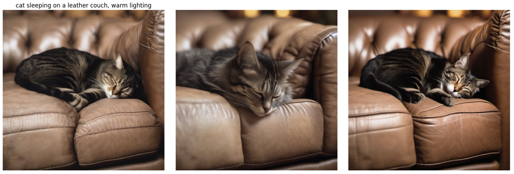

# AI-driven Prompting Strategies for Image Generation

A comprehensive framework for image synthesis, prompt optimization, and evaluation, leveraging the SDXL model.

## Overview

This project implements an automated pipeline for:
- Prompt refinement using multiple strategies
- Quality assessment through diverse metrics
- Benchmark testing across varying prompt difficulty levels


## Project Structure

```plaintext
├── src/
│   ├── prompt_refiner.py      # Prompt enhancement strategies
│   ├── evaluator.py           # Evaluation pipeline
│   ├── run_generate.py        # Generate benchmark execution
│   └── run_evaluate.py        # Evaluate benchmark execution
├── data/
│   └── benchmark_prompts.json # Prompts categorized by difficulty
├── results/                   # Stores generated images with metadata
└── notebooks/                 # Visualization
```


|   |  |
|:--------------------------------------------------------------------------------|:-----------------------------------------------------|


## Model Selection

Utilizes **Stable Diffusion XL (SDXL)**, chosen for its strong community support, ease of deployment, and balanced performance, making it suitable for local experimentation.

## Features

### 1. Prompt Enhancement
- **LLM-based Prompt Refinement**: Tailors user prompts to model capabilities
- **Automatic Attention Map Manipulation**: Implements Prompt-to-Prompt techniques with automatic LLM analysis [[Link]](https://prompt-to-prompt.github.io)
  - **Reweight**: Techniques include reweighting attention for specific tokens
  - **Automatic Token Analysis**: LLM automatically analyzes prompts and extracts key tokens for weighting
- **Batch Generation**: Multiple seeds for optimal results

### 2. Image Generation
- Integration with diffusers `StableDiffusionXLPipeline`
- Support for various generation parameters
- Attention control mechanisms
- Fully automated pipeline for scalable image generation
- Each generated image is supplemented with detailed metadata, including:
  - The original unmodified prompt from benchmark
  - The prompt used during generation
  - Generation parameters, etc.

### 3. Evaluation Pipeline
- CLIP score for prompt-image alignment [[Link]](https://github.com/linzhiqiu/t2v_metrics)
- TIFA score for detailed scene understanding [[Link]](https://tifa-benchmark.github.io).
- Inference time tracking
- Analyzes performance based on prompt difficulty (see *Benchmark Design*).

### 4. Benchmark Design

Prompts are categorized by difficulty and generated automatically:

- **Low**: Simple objects and scenes, minimal lighting.
- **Medium**: Moderate complexity, multiple objects, facial expressions.
- **High**: Complex multi-object scenes, detailed environments, advanced lighting.

### References and Inspiration

- **Leveraging Large Language Models for text prompt enhancement**:  
  - *"HunyuanVideo: A Systematic Framework For Large Video Generative Models"*, [[Link]](https://arxiv.org/abs/2412.03603).

- **Attention reweighting and manipulation techniques**:  
  - *"Prompt-to-Prompt Image Editing with Cross Attention Control"*, [[Link]](https://arxiv.org/abs/2208.01626).
  - *"Attend-and-Excite: Attention-Based Semantic Guidance for Text-to-Image Diffusion Models"*, [[Link]](https://arxiv.org/abs/2301.13826).
